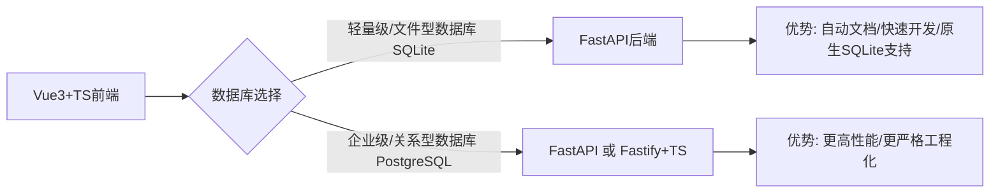

# Vue3+TS全栈技术选型：Python FastAPI+SQLite是最佳轻量级组合

## 引言

当我们需要构建一个**Vue3 + TypeScript + SQLite数据库**的全栈项目时，后端框架的选择直接影响开发效率和最终性能。本文将通过完整的技术栈对比，解释为什么**Python FastAPI**比Node.js Fastify更适合轻量级CRUD应用。

---

## **1. 完整技术栈需求**

你明确提出的技术组合：

| 层级 | 技术选型 | 备注 |
| :--------- | :----------------- | :------------- |
| **前端** | Vue3 + Vite + TS | Composition API |
| **后端** | FastAPI/Fastify | 开发效率与性能的权衡 |
| **数据库** | SQLite3 | 本地文件DB |

---

## 2. 为什么推荐Python FastAPI？

### (1) 前后端对接方便

```js
// Vue3组件调用示例（基于FastAPI自动生成的OpenAPI）
<script setup lang="ts">
const items = ref<Item[]>([])

// 自动类型推断（FastAPI生成openapi.json）
const fetchItems = async () => {
  const res = await fetch('/items/')
  items.value = await res.json() // 自动匹配Item类型
}
</script>
```

✅ **优势**：

* **FastAPI** 自动生成 `openapi.json`，**Vue3** 前端可直接复用类型定义。
* 无需手动维护 `interface`，大幅减少前后端类型不一致问题。

### (2) SQLite集成的优雅实现

```python
# FastAPI直接操作SQLite很方便, 也可以使用简单的ORM如SQLAlchemy等
import sqlite3
conn = sqlite3.connect('app.db')  # 单文件数据库

@app.get("/items/{id}")
async def read_item(id: int):
    cursor = conn.execute("SELECT * FROM items WHERE id=?", (id,))
    return dict(cursor.fetchone())  # 自动转JSON
```

对比Nodejs的Fastify

```typescript
// Fastify需要额外安装better-sqlite3
import Database from 'better-sqlite3';
const db = new Database('app.db');  // 第三方库，增加额外依赖
```

Python 内置了 `sqlite3` 模块，无需额外安装即可直接操作 SQLite 数据库，开箱即用。而 Node.js 则需要依赖第三方库（如 `better-sqlite3`），虽然这些库通常性能良好，但仍增加了项目依赖和初始配置的复杂性。

### (3) 开发效率碾压式对比

| 任务 | FastAPI耗时 | Fastify+TS耗时 |
| :------------------ | :---------- | :------------- |
| 搭建基础CRUD API | 5分钟 | 15分钟 |
| 实现JWT认证 | 10分钟 | 25分钟 |
| 生成API文档 | 0分钟（自动） | 10分钟（配置插件） |

> 💡 **在小数据量和轻量级场景下，FastAPI与Fastify的实际性能体验差异可以忽略，选择框架时更应侧重开发效率和便利性。**

---

## 4. 从零开始的部署指南

### FastAPI方案（极简版）

```bash
# 1. 创建项目
mkdir myapp && cd myapp

# 2. 初始化Python虚拟环境
python -m venv venv
source venv/bin/activate  # Linux/macOS

# 3. 使用uv安装依赖
pip install uv  # 首次安装uv
uv pip install fastapi uvicorn

# 4. 创建app.py（示例代码见上文）

# 5. 启动开发服务器
uvicorn app:app --reload --port 3000
```

### Fastify+TS方案（复杂版）

```bash
# 1. 初始化项目
# 1. 初始化项目
pnpm init
pnpm add typescript ts-node fastify @fastify/swagger better-sqlite3
pnpx tsc --init

# 2. 配置tsconfig.json、编写路由...

# 3. 添加启动脚本
"scripts": {
  "dev": "ts-node app.ts"
}
```

---

## 5. 为什么不推荐Fastify+TS？

### 痛点案例

```typescript
// 实现分页查询的额外工作
import { Type } from '@sinclair/typebox'

const QuerySchema = Type.Object({
  page: Type.Number({ default: 1 }),
  size: Type.Number({ default: 10 })
})
// 还需要手动校验和转换类型...
```

👉 相同功能在FastAPI中只需：

```python
@app.get("/items/")
async def list_items(page: int = 1, size: int = 10):
    return db.query("... LIMIT ? OFFSET ?", (size, (page-1)*size))
```

### 其他问题

* **SQLite支持需额外依赖**：Node.js 使用 SQLite 需要安装第三方库，增加了项目依赖和管理成本。
* **类型同步成本**：虽然有工具可以辅助，但相比 **FastAPI** 的自动生成，**Fastify+TS** 在前后端 **TypeScript** 定义的同步上仍需更多手动干预或额外配置。
* **开发工具链复杂**：需要维护 `tsconfig.json`、`package.json` 等多项配置，对于轻量级项目来说，增加了不必要的复杂度。

---

## **6. 决策流程图解**



---

## **结语**

对于 **Vue3 + TypeScript + SQLite** 的技术组合，**FastAPI 提供了最平滑、最高效的开发体验**：

1. 用 Python 的简洁性有效弥补 TypeScript 在后端配置上的复杂度。
2. 通过自动 OpenAPI 文档生成，根本性地解决了前后端协作中的类型同步问题。
3. 利用 Python 原生 `sqlite3` 模块，确保数据库集成简单且性能稳定。

**最终建议**：

🛠️ 对于**以 SQLite 为数据库的轻量级项目**，**FastAPI 是毫无疑问的最佳选择**。对于需要使用更复杂关系型数据库（如 PostgreSQL）的大型系统，FastAPI 和 Fastify+TS 都是优秀的选项，各有侧重，可根据团队熟悉度和项目具体需求进一步评估。

---

## 附录

* [FastAPI+SQLite完整示例代码](https://github.com/tiangolo/full-stack-fastapi-template)
* [Vue3使用OpenAPI类型生成](https://github.com/ferdikoomen/openapi-typescript-codegen)
* [SQLite性能优化指南](https://phiresky.github.io/blog/2020/sqlite-performance-tuning/)
